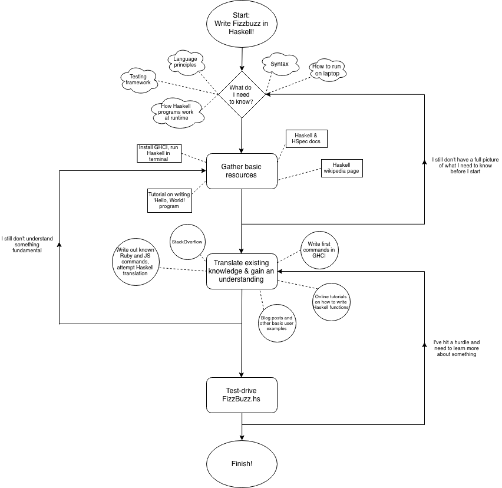

# Haskell fizzbuzz!

This is my attempt at writing fizzbuzz in a new language (Haskell). Testing was done using HSpec.

## My learning process

Here is a diagram I drew up as I completed the project. It maps out the process I take for learning a new language, using this project as an example!

#### To run the tests

1) `cabal update && cabal install hspec`
2) `runhaskell FizzBuzzSpec.hs` (in the program directory)
